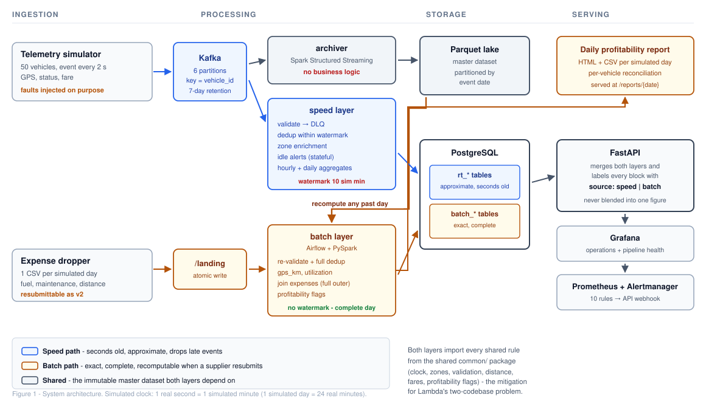
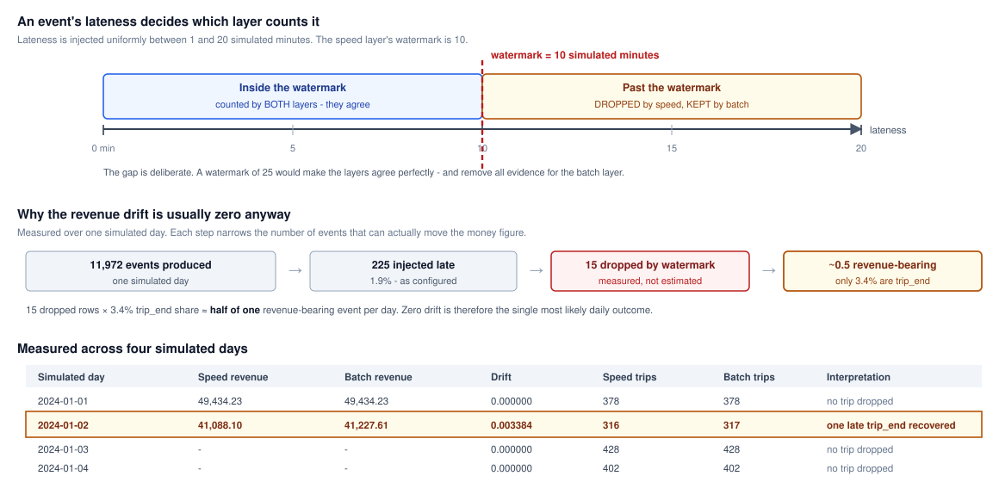

# Fleet operations: a Lambda-architecture data pipeline

**A ride-hailing fleet analytics platform answering live utilization and daily profitability
from one immutable master dataset.**

---

## 1. The problem, and why it needs two answers

The brief asks one question:

> What is fleet utilization and earnings by area and time of day right now, and which vehicles
> are becoming unprofitable once yesterday's fuel and maintenance costs are factored in?

Read carefully, that is two questions with incompatible requirements.

| | Live utilization | Daily profitability |
|---|---|---|
| Latency required | seconds | next morning is acceptable |
| Accuracy required | approximate is fine | exact — it is money |
| Completeness | best effort | must cover the whole day |
| Recomputable? | no need | **yes** — partners resubmit corrected files |
| Consumer | dispatcher watching a map | finance, making retire/keep decisions |

A dispatcher deciding where to send a car needs an answer in seconds and does not care if one
trip is missing. A finance analyst deciding whether to retire a vehicle needs a figure that is
complete, exact, and *reproducible* — because the fuel-card partner can and does resubmit a
corrected expense file days later.

No single processing model serves both well. That observation, not a preference for a named
architecture, is what drives the design.

---

## 2. Architecture decision: Lambda over Kappa

### 2.1 The decision

A **Lambda architecture**: an immutable master dataset written by a dedicated archiver, a
*speed layer* computing approximate live views, and a *batch layer* recomputing exact views
from the complete archive.



***Figure 1** — System architecture. The blue path is the speed layer (seconds old,
approximate); the amber path is the batch layer (exact, complete, recomputable). Both depend on
the same immutable master dataset, and both import every shared business rule from `common/`.*


### 2.2 Why Kappa was rejected

Kappa proposes a single streaming layer, with recomputation achieved by replaying the event
log. It is the more fashionable choice and it is genuinely simpler to operate, so it deserves a
specific rejection rather than a dismissal.

**The decisive argument is recomputation cost.** Our requirement is not merely to reprocess
data — it is to *restate a past day's financial figures* when a partner sends corrected costs.
Under Kappa that means:

1. **Retention must cover any day we might be asked to restate.** A partner correcting last
   month's file forces months of Kafka retention purely to enable periodic recomputation. Our
   actual retention is **7 days**, and it covers only speed-layer recovery and archiver
   catch-up.
2. **Replay is not selective.** Recomputing one day means re-reading the log from at least that
   day's start. A Parquet lake partitioned by `sim_date` lets the batch job read exactly the
   one partition it needs — the measured `compute_vehicle_day` task takes **9.4 seconds** for
   a full simulated day.
3. **The correction is not in the stream at all.** The expense file arrives on a *different
   channel* (a CSV drop), once per day, long after the telemetry it relates to. There is no
   event log to replay that would incorporate it. Kappa's recomputation story simply does not
   address the actual source of restatement.

A batch-only architecture was rejected for the obvious reason: it cannot answer "which vehicles
are idle right now".

### 2.3 What Lambda costs, and our mitigation

The standard criticism of Lambda is **two codebases that drift**: the same business rule gets
written once for streaming and once for batch, and the two copies diverge until the layers
silently disagree.

Our mitigation is structural. A `common/` package holds every rule both layers need — the
simulated clock, zone mapping, event validation, haversine distance, fare maths and all seven
profitability flags — and is imported by the simulators, the speed layer, the batch layer *and*
the serving API.

Two places duplicate deliberately, both for performance, because a Python UDF executing per row
over every event is the most expensive thing this pipeline could do:

| Logic | Python | Spark | Test that pins them together |
|---|---|---|---|
| Event validation | `validate_event()` | `spark_validation_expr()` | `test_spark_validation_matches_the_python_rules` |
| Haversine distance | `geo.haversine_km()` | inline Spark SQL | `test_gps_km_matches_the_python_haversine` |

Each test feeds identical inputs through both implementations and asserts identical outputs.
The duplication is a considered trade-off that is only defensible *because* those tests exist.

---

## 3. Tech stack justification

| Component | Choice | Why this, and not the alternative |
|---|---|---|
| Ingestion | **Kafka 3.8 (KRaft)** | Partitioned ordering is a *correctness* requirement here, not a throughput one — see §4.1. KRaft removes the ZooKeeper dependency entirely. |
| Speed layer | **Spark Structured Streaming 3.5.3** | Event-time windowing, watermarks and `applyInPandasWithState` in one engine. Flink is arguably stronger at state, but using one engine for both layers is precisely what makes `common/` shareable. |
| Master dataset | **Parquet on a volume** | Columnar, partitioned by event date, read selectively. MinIO was the intended object store but its community images are no longer published; every path is built from `LAKE_ROOT` so an `s3a://` bucket is a one-variable substitution. |
| Batch | **Airflow 2.10 + PySpark local mode** | Airflow gives retries, dependency ordering and per-task observability. Local mode because one day is ~12k events that a single JVM chews through in 9 seconds — client-mode submission would add driver/executor routing problems for no gain. |
| Serving store | **PostgreSQL 16** | Both layers' views live side by side in one queryable store. Upserts on natural keys give idempotent sinks (§5.3). |
| API | **FastAPI** | Pydantic response models make the `source: speed\|batch` labelling part of the *schema*, not a convention. OpenAPI docs serve as the demo surface. |
| Observability | **Prometheus + Alertmanager + Grafana** | Pull-based scraping suits long-lived services; §7 explains how short-lived Airflow tasks are handled without a Pushgateway. |

Every image tag and Python package is pinned. There is no `latest` anywhere.

---

## 4. Ingestion

### 4.1 Partitioning is a correctness decision

`fleet.telemetry` has 6 partitions, **keyed by `vehicle_id`**. This is not about throughput.
Kafka guarantees ordering only *within* a partition, and the speed layer's per-vehicle state
machine — which tracks when each vehicle last became idle — assumes it observes one vehicle's
events in the order they occurred. Keying by `vehicle_id` provides exactly that guarantee. A
round-robin key would silently corrupt every idle measurement.

The dead-letter topic `fleet.telemetry.dlq` has 1 partition: it needs no ordering and carries
a trickle of traffic, so one partition keeps every rejected event in a single readable stream.

### 4.2 Deliberate fault injection

The simulator corrupts its own output so that error handling is *demonstrable* rather than
asserted. Measured rates against configured rates, over ~2,700 events:

| Fault | Configured | Measured | What it proves |
|---|---|---|---|
| Malformed JSON | 0.5% | 0.40% | The archiver preserves unparseable bytes; the speed layer dead-letters rather than crashing |
| Schema-invalid | 0.5% | 0.77% | `common/validation.py` rejects identically in both layers |
| Duplicate `event_id` | 1.0% | 1.03% | Deduplication works; both copies are *valid*, so nothing else can stop them |
| Late by 1–20 sim min | 2.0% | 2.09% | **The consistency argument** — see §6 |

The DLQ carries the reason code *and the original payload*, so rejected events are replayable
once a producer is fixed. Observed distribution across five reason codes: `unparseable_json`
58, `coords_out_of_bounds` 23, `bad_status` 17, `negative_fare` 12, `negative_speed` 10.

### 4.3 Changes to the data contract

Three fields were added, each for a specific architectural reason:

- **`event_id`** (uuid) — deduplication needs a stable identity.
- **`event_type`** (`ping`/`trip_start`/`trip_end`) — *this one is structural.* Without an
  explicit lifecycle marker, counting trips requires detecting a status *transition* and then
  aggregating, which is a chained stateful operator; Structured Streaming forbids an
  aggregation after one. With the marker, "trips completed" is a plain
  `count(WHERE event_type='trip_end')` that works identically in both layers.
- **`schema_version`** (int) — allows a future v2 producer to coexist with v1 consumers.

One interpretation matters downstream: **`fare` is cumulative within a trip and final only on
`trip_end`**, zero elsewhere. Revenue is therefore `SUM(fare) WHERE event_type='trip_end'` in
both layers. Summing `fare` across all rows would multiply revenue by roughly the number of
pings per trip — the single easiest way to get this pipeline's headline number wrong, so it
carries a test in the simulator, the speed layer and the batch layer.

---

## 5. Processing

### 5.1 The archiver is deliberately boring

The archiver is a *separate Spark application* with its own checkpoint and **no business logic
whatsoever**. The master dataset is the source of truth from which every past day is
recomputed; if it is corrupted, all history is wrong and nothing can recover it. Isolating it
means a bug in the speed layer's validation, windowing or state handling *cannot reach it* —
the worst such a bug can do is produce wrong dashboards, which the next batch run overwrites.

Unparseable records are archived under `sim_date=unknown` with their raw bytes intact. An
archive that silently discarded malformed records would make "how much bad data did we
receive?" permanently unanswerable.

### 5.2 Stateful idle alerts

"Has this vehicle been idle for 45 simulated minutes?" cannot be answered by a window or an
aggregation. It requires memory of *when* the vehicle last stopped being idle, carried across
micro-batches, and the ability to fire when **no** new event arrives — a silent vehicle being
precisely the case of interest. `applyInPandasWithState` is the only Structured Streaming
construct providing both.

Four subtleties, each a bug if mishandled:

1. **The idle stopwatch starts on the *transition* into idle**, not on every idle ping.
   Resetting per ping means the timer never advances and no alert can ever fire.
2. **Events are sorted by event time before folding** — a micro-batch may interleave partitions.
3. **A stale out-of-order event does not rewind the state.** It is not lost (the archive holds
   it and the batch layer counts it), but rewinding would corrupt the idle measurement.
4. **`EventTimeTimeout`, not `ProcessingTimeTimeout`** — a processing-time timeout fires after
   N *real* seconds, so changing the clock compression would silently change the business rule.

A known consequence, stated rather than hidden: an event-time timeout only fires when the
watermark advances, and the watermark only advances when other events arrive. Were the entire
fleet to go silent simultaneously, no timeout would fire. That case is covered by a different
control — the `TelemetryNotProduced` alert, which watches the producer directly.

### 5.3 Idempotent sinks

`foreachBatch` provides **at-least-once** delivery. If the driver dies after writing a
micro-batch but before committing offsets, Spark re-runs that batch and the sink observes the
same rows twice. Under plain inserts, every dashboard figure would ratchet upward on each
restart and never recover.

Every sink therefore upserts on a **natural key**: `rt_vehicle_state` on `(vehicle_id)`,
`rt_zone_hourly` on `(zone_id, window_start)`, `rt_vehicle_daily` on `(vehicle_id, sim_date)`,
`idle_alerts` on `(vehicle_id, opened_at)`. The repeated write sets identical values, making
the sink idempotent — the practical equivalent of exactly-once semantics.

This also permits `update` output mode for the windowed aggregations, which is necessary
because `append` would withhold a window until the watermark passed its end, meaning the
*current* simulated hour — the thing a live dashboard exists to show — would never appear.

### 5.4 The batch layer trusts nothing

`compute_vehicle_day` re-reads the raw archive and **re-applies the same validation and
deduplication from scratch**. It does not read the speed layer's output at all. Critically it
applies **no watermark**: it reads a complete, closed day, so lateness is irrelevant to it, and
it deduplicates across the entire day rather than within a watermark window.

Its outputs per vehicle-day: `trips`, `revenue`, `gps_km` (haversine between consecutive pings,
with physically impossible jumps above 150 km/h discarded), `online_min`, `on_trip_min`,
`idle_min` and `utilization`.

The reconciliation joins telemetry to expenses with a **full outer join**, deliberately: an
inner join would silently drop the two findings the business most needs — telemetry with no
expense row (`missing_costs`: we are blind to a vehicle's costs) and an expense row with no
telemetry (`missing_telemetry`: we are being billed for a vehicle that never reported).

---

## 6. The consistency argument — the core evidence

This section is the empirical justification for the entire architecture.

The speed layer applies a **10-simulated-minute watermark**; the simulator injects lateness of
up to **20 simulated minutes**. The gap is deliberate. A watermark of 25 would catch everything,
the two layers would agree perfectly, and the project would have no evidence for why the batch
layer exists. A regression test fails if anyone raises it.



***Figure 2** — Why the two layers disagree, and by how much. An event's lateness decides which
layer counts it; the funnel shows why that translates into a near-zero revenue drift on a
typical day.*

### 6.1 Results over four simulated days

| Simulated day | Fleet margin | Unprofitable | Becoming unprofitable | Distance mismatches | Revenue drift |
|---|---|---|---|---|---|
| 2024-01-01 (partial) | 42.8% | 6 | 0 | 2 | 0.000000 |
| 2024-01-02 | 38.3% | 4 | 0 | **21** | **0.003384** |
| 2024-01-03 | 45.8% | 3 | 6 | 6 | 0.000000 |
| 2024-01-04 | 47.7% | 4 | 7 | 4 | 0.000000 |

On **2024-01-02** the drift was 0.34%, with `speed_trips = 316` against `batch_trips = 317`:
**exactly one late `trip_end` event was dropped by the watermark and recovered by the batch
layer.** That single row is the clearest evidence in the project — the mechanism is real,
measurable, and attributable to a specific event.

### 6.2 Why the drift is usually zero, and why that is the stronger finding

We expected a visibly non-zero drift every day. Measuring why it is usually zero produced a
better argument than a dramatic number would have.

| Quantity | Measured |
|---|---|
| Events produced (one day) | 11,972 |
| Late events injected | 225 (1.9%) |
| Rows dropped by the watermark | 15 |
| Share of events that are `trip_end` | 3.4% |
| **Expected dropped revenue-bearing events** | **15 × 0.034 ≈ 0.5 per day** |

So the watermark drops roughly *half of one* revenue-bearing event per day. Zero drift is the
single most likely outcome, and non-zero appears on some days — which is precisely what the
four-day table shows.

**Two metrics, two jobs**, and the report uses both:
- `fleet_late_rows_dropped_total` demonstrates the **mechanism** — reliably non-zero.
- `fleet_speed_batch_drift_ratio` demonstrates its **financial materiality** — usually near zero.

The case for computing money in the batch layer was never "the speed layer is wildly wrong". It
is that **the speed layer's error is unbounded in principle and unknowable in advance**. A
watermark is a bet on how late data arrives; most days that bet is won comfortably. But a
partner resubmitting a corrected file for last month is a restatement no watermark value
addresses. Only recomputation from an immutable archive does.

We deliberately did *not* inflate the injected fault rates to manufacture a larger figure.
Reporting `0.000000` alongside the arithmetic above is more defensible than reporting 8%
obtained by quietly changing the simulator.

### 6.3 Recomputation demonstrated

Two experiments confirm the property the architecture exists to provide:

- **Corrected resubmission.** Dropping a `v2` expense file for an already-reconciled day made
  it pending again. The recompute produced **the same 50 rows with different values**
  (net profit 19,770.78 → 21,177.99), and the quarantined-row count fell from 1 to 0. The load
  is delete-then-insert per date inside a single transaction, so reruns are idempotent.
- **Deterministic replay.** A manual trigger with `{"sim_date": "2024-01-03", "force": true}`
  recomputed that date to **bit-identical figures** (net 24,902.95) with a fresh `computed_at`
  timestamp — confirming that recomputation from the archive is deterministic, not merely
  repeatable.

---

## 7. Storage and serving

### 7.1 The Lambda merge is explicit, never blended

`GET /vehicles/{id}` returns three blocks, each labelled with its `source` and `as_of`:

```json
{ "live":    { "source": "speed", "as_of": "...", "status": "idle" },
  "today":   { "source": "speed", "trips": 4, "revenue": 512.25 },
  "history": [ { "source": "batch", "sim_date": "...", "net_profit": 570.0 } ] }
```

They are deliberately **not merged into a single figure**. The two layers answer different
questions with different guarantees, and a consumer must be able to tell at a glance which
numbers are safe to quote to finance. Blending them is precisely how a dashboard estimate ends
up in a financial statement.

"Now" is always *simulated* now, derived from `max(last_event_time)` rather than the database
clock — so if ingestion stalls, "now" stops advancing and the active-vehicle count correctly
falls to zero rather than quietly lying.

---

## 8. Observability design

### 8.1 What is measured, and why

Three questions drive every metric. Nothing is collected because it was easy to collect.

| Question | Metrics | Why it is not obvious |
|---|---|---|
| *Is data arriving?* | `fleet_events_produced_total{event_type}`, `fleet_faults_injected_total{kind}` | Distinguishes "the producer is silent" from "the producer is gone" — the alert needs both `increase()==0` and `absent()`. |
| *Is it being processed?* | `fleet_stream_last_progress_timestamp{query}`, `..._processed_rows_per_second`, `..._offsets_behind_latest` | Freshness is per-query, not per-process. A container can be perfectly healthy while one of its five queries is frozen. |
| *Is it correct?* | `fleet_dlq_events_total{reason}`, `fleet_late_rows_dropped_total`, `fleet_speed_batch_drift_ratio` | These measure *known, accepted* imprecision. A pipeline that cannot quantify its own error cannot be trusted with money. |
| *Is the business healthy?* | `fleet_open_idle_alerts`, the profitability flags | Deliberately separate from pipeline health: `IdleVehiclesHigh` fires when everything is working and the fleet simply is not earning. |

### 8.2 Structured logging across all stages

Every log line is a single JSON object carrying `ts`, `level`, `service`, **`stage`**
(`ingestion`/`processing`/`storage`/`serving`/`orchestration`), `event`, `msg` and
**`sim_time`**.

`sim_time` is the field that matters here. On a compressed clock a wall-clock timestamp tells
you nothing about *which simulated hour* a line belongs to, so every line carries both. Filtering
by stage is what makes a cross-cutting failure diagnosable:

```bash
make logs s=speed   | grep '"event": "micro_batch"'
make logs s=airflow | grep '"event": "reconciliation_complete"'
```

Per-event logging is **sampled 1-in-N**: at 50 vehicles emitting every 2 seconds, an INFO line
per event would bury everything else. The useful granularity is one line per micro-batch
carrying counts.

### 8.3 Tracing — an honest position

We do **not** implement distributed tracing (OpenTelemetry spans). What we implement is
**correlation-ID propagation**, which gives most of the diagnostic value at a fraction of the
operational cost for a pipeline of this size:

| Id | Propagated through |
|---|---|
| `event_id` | producer → Kafka → archiver → DLQ → batch dedup |
| `vehicle_id` | every stage, and it is the Kafka partition key |
| `run_id` | every Airflow task, `batch_runs`, `dq_issues`, `batch_vehicle_daily` |
| `sim_date` | the lake partition, every batch table, the report filename |

A single rejected event can be traced from its DLQ reason back to its original payload; a single
reconciled figure can be traced back to the run and expense-file version that produced it. What
this does *not* give is per-request span timing across service boundaries. For a pipeline whose
hops are Kafka offsets and Parquet partitions rather than RPC calls, spans would add
infrastructure without answering a question we actually have. At production scale this changes —
see §12.

### 8.4 Alerting decisions worth defending

**Kafka lag comes from Spark's own query progress, not a lag exporter.** Structured Streaming
does not commit consumer-group offsets — it tracks them in its checkpoint — so
`kafka-consumer-groups.sh` and every off-the-shelf exporter report *nothing* for these
consumers. The figure exists only in the progress event's source metrics.

**Batch metrics are exported by the API from PostgreSQL, not pushed.** Airflow tasks are
short-lived processes; Prometheus pulls, so by scrape time the task has exited. A Pushgateway
would work but is another service holding job state indefinitely with no notion of staleness,
and is explicitly discouraged for this pattern. The batch layer already persists its outcomes
because the API and report need them, so re-exporting costs nothing and guarantees the metric
and the report can never disagree.

Ten alert rules are defined, each with a `for:` duration, a severity, and a runbook entry.
**Five have been verified firing and delivered** end-to-end through Alertmanager into the
`alert_notifications` table (`TelemetryNotProduced`, `ExpenseFileLate`, `DLQRateHigh`,
`BatchNotRunRecently`, `ApiDown`) — delivery is demonstrable, not merely asserted.

A sixth, `BatchRunFailed`, fired but was **deliberately not delivered**: a missing partner file
causes the reconciliation to record a failed run, so it fired alongside `ExpenseFileLate` for
one root cause. An Alertmanager inhibit rule suppresses it, which was confirmed in the API
(`inhibitedBy = 1`). Two alerts for one cause, where the second is misleading — nothing in the
pipeline is broken, we are waiting on a supplier — is how alert channels become ignored. Measured batch task
durations: `compute_vehicle_day` 9.44 s, `load_batch_views` 0.99 s, `reconcile_profitability`
0.45 s, all others under 0.04 s.

---

## 9. What running it actually taught us

Six defects were found by operating the system, not by reading the code. They are reported
because each one generalises.

**1. A healthcheck that proves liveness proves nothing about work.** Restarting the Spark
worker killed the archiver's executor. The driver logged `Disconnected from Spark cluster!` and
then simply sat there: the query remained "active", so `awaitTermination()` never returned. The
container stayed up, **its healthcheck stayed green** — the metrics endpoint is served by the
live driver — and the archiver silently stopped writing the master dataset for 26 minutes. The
batch layer then reconciled a day from an incomplete archive. The fix, `streaming/watchdog.py`,
monitors *progress* rather than liveness and exits so Docker restarts from the checkpoint. It
was verified by deliberately killing the executors: the speed layer reported
`vehicle_state has not progressed for 132s`, exited, restarted and resumed.

**2. A correct pipeline can produce a useless answer.** The first full reconciliation flagged
**35 of 50** vehicles as unprofitable, with costs at 1.9× revenue. The pipeline was correct
throughout; the *economics* were not calibrated — fuel cost 7.35 CU/km against roughly 9.25 CU
revenue per driven kilometre, and service visits costing 3–6× a vehicle's daily revenue. After
recalibration the figure is **3–6 of 50** with a 38–48% fleet margin. Only running it end to
end on realistic volumes surfaced this.

**3. Intervals chosen in real seconds are 60× longer in business terms.** The odometer ledger
checkpointed every 30 *real* seconds — which at COMPRESSION=60 is 30 *simulated* minutes. A
container restart lost ~90 km of ledger, and the batch layer flagged **21 of 50** vehicles for
a distance mismatch the partner had not caused. A check that fires because of our own restart
is worse than no check: it trains the reader to ignore it.

**4. Shared code publishes shared metrics.** The batch gauges were defined in `common/metrics.py`,
which every service imports — so all five exported `fleet_batch_last_success_timestamp` at its
default of 0. Prometheus saw five series, four permanently zero, and `BatchNotRunRecently` fired
forever on the bogus ones. A permanently-firing false alert is worse than no alert.

**5. An alert that fires on a normal operation is noise.** The expense SLA was evaluated against
every file version, so a corrected `v2` — by definition sent after the deadline — marked every
resubmission late. The SLA now governs first delivery only.

**6. Acceptance checks must actually be run.** The "fresh clone → one command" criterion
exposed two defects in the Windows helper script that no amount of reading would have found:
PowerShell converting docker's normal stderr progress into a terminating error, and a wrapper
function binding docker's `-d` flag to itself so the stack came up in the foreground.

---

## 10. Verification summary

| Check | Result |
|---|---|
| Unit, PySpark and API tests | **202 passed** |
| End-to-end smoke test against the live stack | **28 / 28** |
| Fresh clone → single command | All 13 services healthy, pipeline serving live data |
| Simulated days reconciled | 4 clean days, 38–48% fleet margin |
| Alert rules verified firing *and delivered* | 5 of 10 (a 6th fires but is intentionally inhibited) |
| Grafana panel queries returning live data | 23 of 23 |

---

## 11. Known limitations

Stated plainly, because a report claiming no weaknesses is not believed.

- **Simulated day 1 is partial** (06:00 start), so vehicles on night shifts work only part of
  it while carrying a full day's standing cost.
- **The revenue drift is usually zero** for the reasons measured in §6.2. The mechanism is
  visible in `fleet_late_rows_dropped_total`; its financial impact usually is not.
- **`becoming_unprofitable` requires three reconciled days**, so it cannot be demonstrated in a
  short session. This is correct behaviour — we refuse to infer a trend from two points.
- **"Lemon" vehicles are flagged more often, not always** — 25% of vehicle-days against 12.8%
  for the rest of the fleet. A high-maintenance vehicle only looks bad on a day it breaks, and
  a low-demand vehicle earns less but also spends less. Realistic, but a demo should name a
  specific vehicle rather than promise that every lemon appears.
- **Batch Spark runs in local mode**, so the project demonstrates distributed *streaming* but
  not distributed *batch*.
- **Downtime creates genuine data gaps.** The simulated clock is derived from wall-clock time,
  so while the stack is stopped, simulated hours pass with no events emitted. A fifth simulated
  day was measurably degraded by our own deliberate outage testing. The pipeline reports the
  reduced revenue faithfully rather than fabricating it — correct behaviour, but it means
  operational downtime is indistinguishable from low demand in the data, which a production
  deployment would need to annotate.
- **One Kafka broker, RF 1.** Replication is out of scope, so broker loss means losing anything
  not yet archived.

---

---

## 12. At production scale: what we would do differently

Everything below is a deliberate simplification for a two-week, single-laptop project, paired
with what would actually be required if this ran a real fleet.

### 12.1 Ingestion

**Today:** one Kafka broker, replication factor 1, 6 partitions, 7-day retention.
**At scale:** a minimum of three brokers with RF 3 and `min.insync.replicas=2`. Today a broker
loss means losing anything not yet archived — acceptable for a demo, indefensible for revenue
data. Partition count would be driven by measured consumer throughput, but the *keying* would
not change: `vehicle_id` keying is a correctness constraint, not a tuning knob, and it caps
useful parallelism at the number of vehicles.

**Schema governance.** We version events with `schema_version` and validate defensively. A
production deployment would put a **schema registry** (Avro or Protobuf) in front of the topic
so incompatible producers are rejected at publish time rather than discovered in the DLQ. The
DLQ would also gain an automated replay path; today replay is manual.

### 12.2 Storage

**Today:** Parquet on a Docker volume, partitioned by `sim_date`.
**At scale:** object storage (S3/GCS) — already a one-variable change, since every path is built
from `LAKE_ROOT`. Two additions would matter quickly:

- **A table format** (Iceberg or Delta Lake) for atomic partition overwrites, schema evolution
  and time travel. Our `load_batch_views` achieves atomicity inside PostgreSQL via
  delete-then-insert in a transaction; the *lake* copy has no such guarantee, so a failed
  curated write can leave a partial partition.
- **Compaction.** The archiver writes every 30 seconds, which is a deliberate small-files
  trade-off. At real volume a scheduled compaction job becomes mandatory, or the batch *read*
  ends up slower than the batch *compute*.

### 12.3 Processing

**Today:** Spark standalone, one worker, 3 cores, both streaming applications co-resident.
**At scale:** Kubernetes with the Spark operator, giving per-application resource isolation and
autoscaling. The single most valuable change would be **decoupling the archiver from the speed
layer entirely** — they already have separate checkpoints, but they currently compete for the
same worker's cores, which is how we lost 26 minutes of archiving (§9).

**Batch would stop running in local mode.** That choice is sound at 12k events/day and wrong at
12M; `compute_vehicle_day` is already written as ordinary Spark SQL, so the change is a
submission target, not a rewrite.

### 12.4 Serving

**Today:** a single PostgreSQL instance serving both layers, queried directly by Grafana.
**At scale:** the access patterns genuinely diverge. `rt_*` is high-frequency point lookups and
upserts; `batch_*` is analytical scans over history. We would keep PostgreSQL for the real-time
tables, add read replicas for Grafana so dashboard queries cannot slow the streaming sinks, and
move `batch_vehicle_daily` to a columnar warehouse once history outgrew a single node.

The API would gain caching on `/fleet/live` (it is read far more often than the underlying data
changes) and authentication, which is explicitly out of scope here.

### 12.5 Observability

**Today:** Prometheus, Alertmanager, Grafana, structured JSON logs, correlation IDs.
**At scale:** three additions, in priority order.

1. **Log aggregation** (Loki, or ELK). Today diagnosing a cross-service issue means
   `docker compose logs` per service. The logs are already structured JSON with a `stage` field
   specifically so they can be shipped and queried without reformatting — this is a deployment
   step, not a code change.
2. **Real distributed tracing.** As argued in §8.3, spans buy little for a Kafka-and-Parquet
   pipeline at this size. That calculus flips once there are multiple upstream producers and
   several consuming services, where "which producer caused this DLQ spike?" stops being
   answerable from correlation IDs alone.
3. **SLOs with error budgets**, replacing fixed thresholds. `IdleVehiclesHigh > 8` is a magic
   number tuned to a 50-vehicle fleet; it does not survive the fleet doubling. An SLO expressed
   as a *ratio* would.

### 12.6 The simulated clock

This is the largest single simplification and it has a subtle consequence worth stating.
Because simulated time is derived from wall-clock elapsed time, **the pipeline being down does
not pause the world** — simulated hours keep passing with no events emitted, creating a genuine
data gap. We observed exactly this: a simulated day degraded measurably during our own outage
testing (§11).

The pipeline reports the reduced revenue faithfully rather than fabricating it, which is the
correct behaviour. But it means **operational downtime is indistinguishable from low demand in
the data**. A production system would annotate known outage windows so that downstream
consumers — and the `becoming_unprofitable` trend rule in particular — can exclude them rather
than mistaking an incident for a commercial decline.

## 13. Conclusion

The business question posed by the brief contains two sub-questions with incompatible latency,
accuracy and recomputability requirements. A Lambda architecture is justified here not by
convention but by a specific property Kappa cannot supply economically: **restating a past day's
financial figures when a correction arrives on a different channel, days later.**

The project demonstrates that property directly — a corrected file triggers an idempotent
recompute producing the same row count with updated values, and a forced replay reproduces
bit-identical figures. It also *quantifies* the cost of the speed layer's approximation rather
than asserting it, measuring one dropped revenue-bearing event on one day of four and
explaining, arithmetically, why that is the expected magnitude.

Lambda's principal weakness — divergent codebases — is mitigated structurally by a shared
`common/` package, with the two performance-motivated duplications pinned together by tests
that feed identical inputs through both implementations.

The most valuable outcome was not the architecture but what operating it revealed: a green
healthcheck on a dead archiver, a correct pipeline producing economically meaningless output,
and an interval that was 60× longer than intended because it was expressed in the wrong clock.
Each was found by running the system and checking the numbers against expectations, which is
the habit the project is ultimately arguing for.
